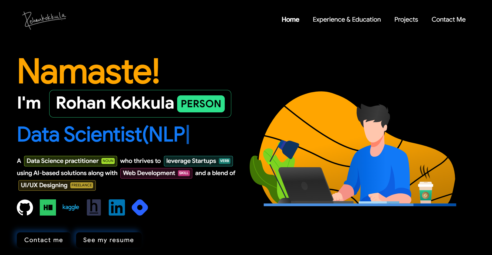

<p align="center"> 
    </img>
</p>

<h3 align="center"> A clean, beautiful, responsive and 100% customizable portfolio <br /> template for Data Scientists! </h3>

<p align="center">
  <a href="https://nodejs.org/en/blog/release/v12.13.0/"></a>
  <a href="https://www.npmjs.com/package/npm/v/6.13.4"></a>
  <a href="https://reactjs.org/"></a>
  <a href="https://github.com/prettier/prettier"></a>
  <br/>
  <a href="https://app.netlify.com/sites/ashutosh1919portfolio/deploys"></a>
  <a href="https://travis-ci.org/badges/badgerbadgerbadger"></a>
  <a href="https://github.com/ashutosh1919/masterPortfolio/commits/master"></a>
  <a href="http://badges.mit-license.org/"></a>
  <a href="https://ashutoshhathidara.com/"></a>
  <a href="https://img.shields.io/badge/price-free-ff69b4"></a>
</p>
<p align="center"> 
    <a href="https://rohankokkula.netlify.app" target="_blank">
    </img>
  </a>
</p>

# Sections 📚

✔️ Home\
✔️ Experience & Education \
✔️ Projects\
✔️ Contact\
<br>
To view a live example, **[click here](https://rohankokkula.netlify.app/)**

# Clone And Use 📋

- The website is completely built on `react-js` library of `javascript` and that's why we need `nodejs` and `npm` installed.
- While installing `nodejs` and `npm`, try to install versions which are equal or greater than the versions mentioned in badges above.
- In case you want to help developing it or simply saving it, you can fork the repository just by clicking the button on the top-right corner of this page.
- After the successful installation of `nodejs` and `npm`, clone the repository into your local system using below command:
  - ```python
     git clone https://github.com/rohankokkula/datasciencefolio.git
    ```
  - This will clone the whole repository in your system.
- `nvm use` to use the project's v12 node version so you don't have to see millions of node module errors :) 
- To download required dependencies to your system, navigate to the directory where the cloned repository resides and execute following command:
  - ```python
    npm install
    ```
- Now, the project is ready to use.
- You can check it using `npm start`, it will open the website locally on your browser.

# Customize it to make your own portfolio ✏️

In this project, there are basically 4 things that you need to change to customize this to anyone else's portfolio: **src/portfolio.js**, **src/assets**,**src/assets/logo** and **Google Analytics Tracking ID**.

### Personal Information

You will find `src/portfolio.js` file which contains the complete information about the user. The file looks something like below:

```python
// Home Page
const greeting = {
    ...
}

// Social Media
const socialMediaLinks = {
    ...
}

...
```

You can change the personal information, experience, education, social media, certifications, contact information etc. in `src/portfolio.js` to directly reflect them in portfolio website.

If you want to play around with alignment or CSS, the specific component's css is present in the same folder.

### Assets

So basically I demonstrated 2 types of visual graphics.
- Animated graphics([lottiefiles](https://lottiefiles.com/))
  - In order to use your own animated graphics, 
    - go to [lottiefiles](https://lottiefiles.com/) 
    - search your favourite lottie(animation)
    - Download the `JSON` version of animated file
    - Now you can import this into any of the desired container/component using
    - ```
      import lottie from 'lottie-web';
      import React, {useRef,useEffect } from "react";
      export default function BannerImg(){
      const container = useRef(null)
      useEffect(() => {
        lottie.loadAnimation({
          container: container.current,
          renderer: 'svg',
          loop: true,
          autoplay: true,
          animationData: require('./banner.json')})}, [])
        return (
          <div className="App">
            <div className="container" ref={container}></div>
          </div>);} 
      ```
    - here, `banner.json` is your downloaded animated file

- Static pngs/svgs/jpeg
  - you need to add the desired pngs to the same folder of `any-component.js`
  - U need to uncomment the following code and remove the above animated lottie's code
  - ```
    class BannerImg extends Component {
    render() {
      return (
        <div className="App">
          <div className="container">
            
          </div>
        </div>
        );}
      }
    export default BannerImg;
    ```
- to save up your time and get you out of confusion, I've created both the versions(animated & static svgs) and commented it out.
- So if you don't like to use animated svgs, just delete that code and uncomment the function for static svgs

### Splash Logo

Note here that if you click [my portfolio](https://rohankokkula.netlify.app), you can see the logo at the beginning. 

  - You can open `src/portfolio.js` file and at the top of this file you will see `settings` component as below:
  - ```python
    // Website related settings
    const settings = {
      isSplash: true,
    };
    ```
  - Change `isSplash` from `true` to `false`.
  - Now, if you see your website using `npm start`, it will directly open `home` rather than logo `splash` screen.
  - You can change it from `src/assets/logo` and replace with your own signature logo


### Google Analytics Tracking ID

- First, you need to set up your Google Analytics Account.
- Follow these resources for seamless setup
    - [Easy Google Analytics 4 Setup 2021](https://www.youtube.com/watch?v=dPYx-eS4gyE)
    - [Track Users In Your React App With Google Analytics](https://www.youtube.com/watch?v=pBeKlQ6CMJM)
- You'll be needing a Trackin-ID for your website which normally looks like `UA-199564465-1`
- Do not get confused between Tracking-ID & Measurement ID. Both are Different.
- Once you get the tracking ID, go to `src/App.js` and replace your tracking ID
Note: Do not use Firefox Browser for testing the ID. Use Chrome instead.


# Deployment 📦

- Once you are done with your setup and have successfully completed all steps above, you need to put your website online!
- I highly recommend using [Netlify](https://www.netlify.com/) to achieve this the EASIEST WAY.
- To deploy your website, you need to follow 2 steps. 
    -   First you need to create a github repository and push all the files excluding node_modules(automatically ignored by .gitignore)
    -   setup account at netlify & complete the login/signup process
    -   Now, click on `New site from Git` and connect it with your github account
    -   You will find the entire list of your repositories, select your portfolio repo.
    -   Click on `Deploy site`
    -   Tadaa! Your site is live!

# Technologies used 🛠️

- [React](https://reactjs.org/)
- [graphql](https://graphql.org/)
- [apollo-boost](https://www.apollographql.com/docs/react/get-started/)
- [baseui](https://github.com/uber/baseweb)
- [react-reveal](https://www.react-reveal.com/)
- [styled-components](https://styled-components.com/)

# Animations 🍥

- [lottiefiles](https://lottiefiles.com)

# License 📄

This project is licensed under the MIT License - see the [LICENSE.md](./LICENSE) file for details.

# References 👏🏻

- Some Design and Implementation Ideas are taken from [Ashutosh Hathidara's Portfolio Project](https://github.com/ashutosh1919/masterPortfolio) & [Saad Pasta's Portfolio Project](https://github.com/saadpasta/developerFolio)
